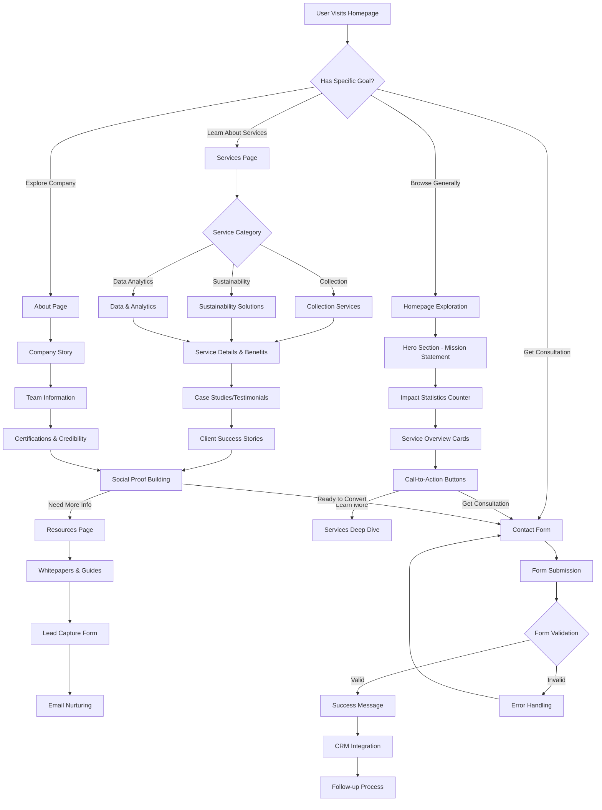
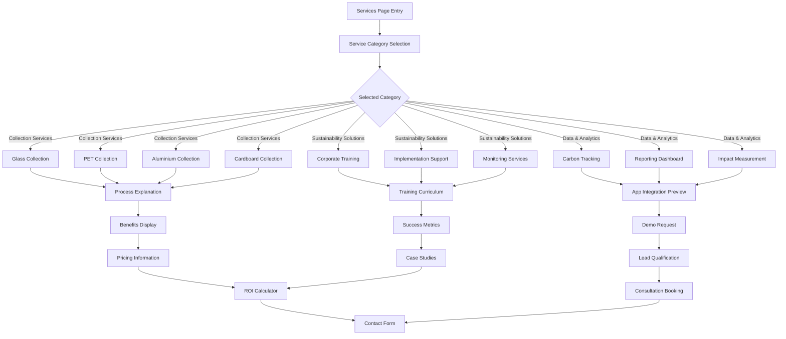
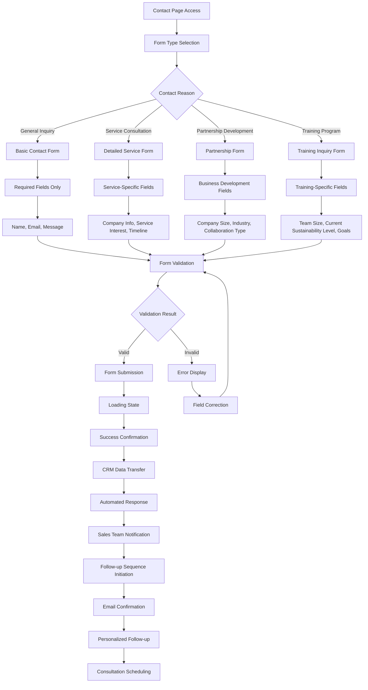
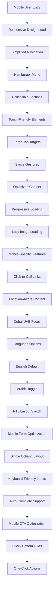
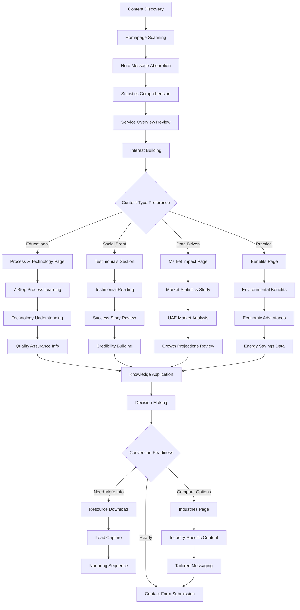
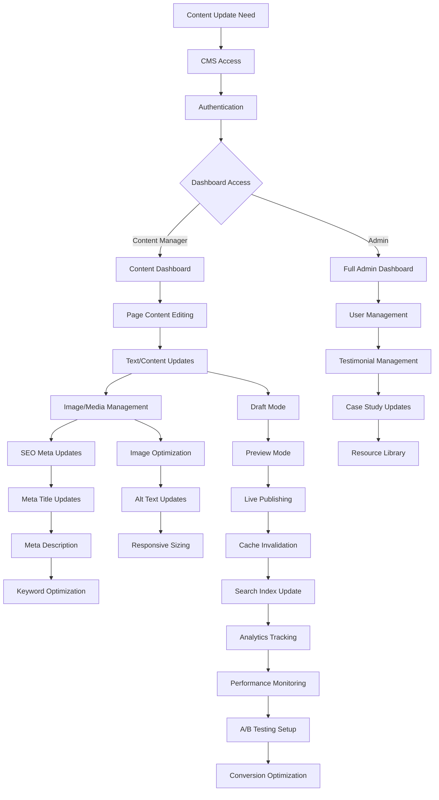
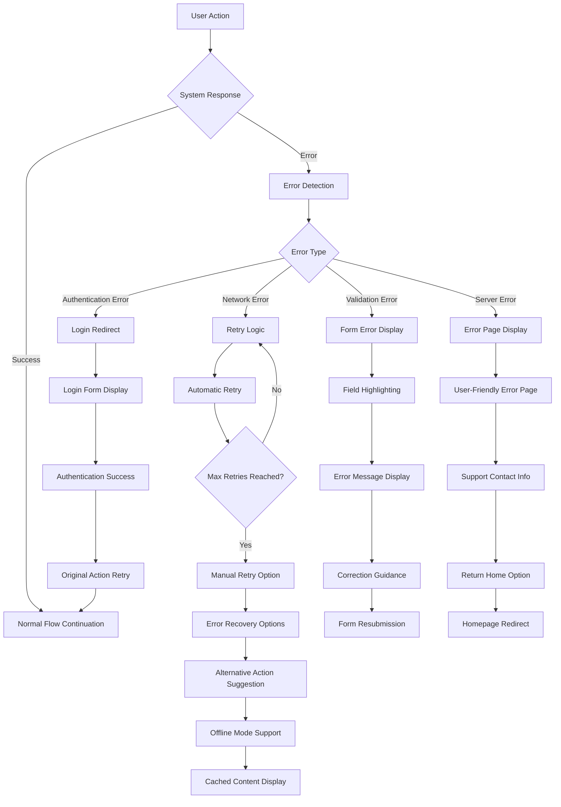
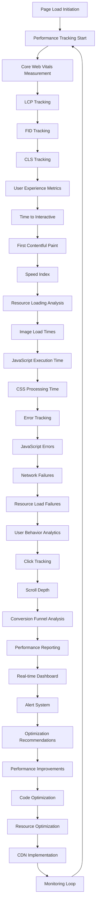

# Cirqura Website User Flow Diagram

## Main User Journey Flowchart

## Detailed Service Exploration Flow

## Contact & Conversion Flow

## Mobile User Experience Flow

## Content Consumption Flow

## Admin/Content Management Flow

## Error Handling & Recovery Flow

## Performance Monitoring Flow

This comprehensive user flow diagram covers all major interaction patterns for the Cirqura website, from initial visitor engagement through conversion and ongoing engagement.